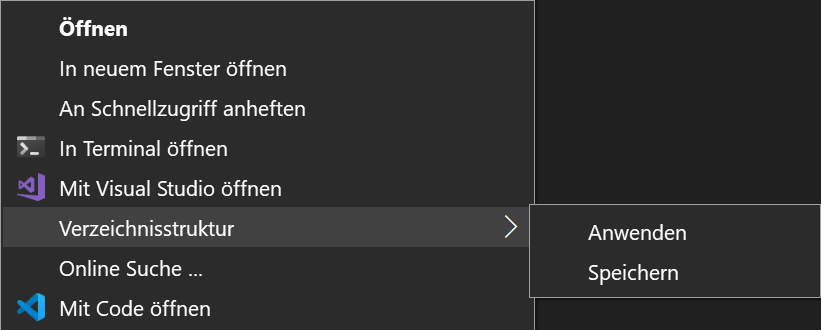
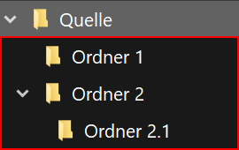
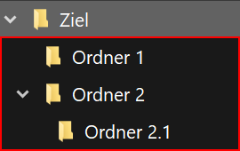
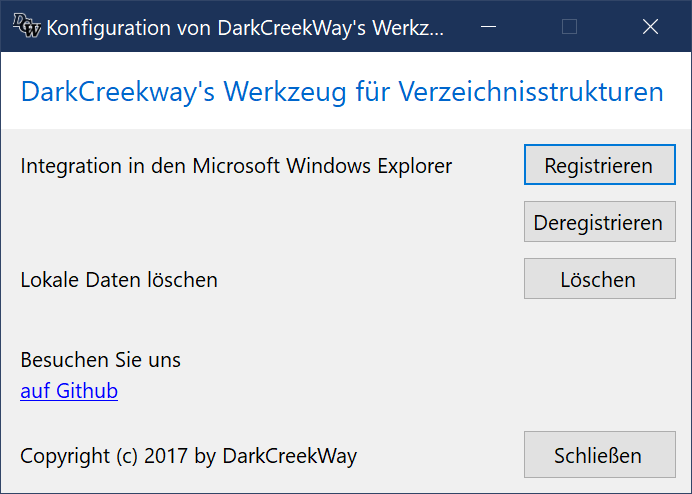


# DarkCreekway's Werkzeug für Verzeichnisstrukturen

---

## Einführung

Dateien mit Hilfe von Verzeichnissen zu strukturieren bietet viele Vorteile.

* Es erleichtert das Finden wichtiger Informationen und trägt dazu bei, die
  steigende Datenflut effizient zu bewältigen.

* Sorgt für flüssigeres Arbeiten durch Entlastung des Systems, da mit
  zunehmender Anzahl von Dateien in einem Verzeichnis viele Computersysteme
  länger für die Auflistung benötigen.

Eine Bewährte Verzeichnisstruktur auf weitere oder neue Verzeichnisse
zu übertragen ist allerdings nicht ohne weiteres möglich.

Der Einsatz von z.B. der **Kopieren & Einfügen** Funktion des Microsoft Windows
Explorers scheidet aus, da nicht nur die Struktur, sondern auch alle Dateien
kopiert werden.
So bleibt nur der Weg offen, die gewünschte Struktur von Hand neu anzulegen.

**DarkCreekWay's Werkzeug für Verzeichnisstrukturen** schließt diese Lücke und
ist bequem über das Microsoft Windows Explorer Kontextmenü erreichbar.

**Screenshot des Kontextmenüs (Windows 10 Dark Mode)**

---

## Funktionalität

Verzeichnisstrukturen (oder kurz Strukturen) unterhalb eines Verzeichnisses
können über das Windows Explorer Kontextmenü gespeichert und dann beliebig oft
auf andere Verzeichnisse angewendet werden.

### Beispiel

Die Struktur des Verzeichnisses *Quelle* soll auf das Verzeichnis *Ziel*
übertragen werden.

|Quelle|Ziel|
|-|-|-|
|  |  |
| Verzeichnis *Quelle* mit Struktur | Verzeichnis *Ziel* ohne Struktur (leer) |

Dazu muss die Struktur des Verzeichnisses *Quelle* zunächst im Werkzeug
gespeichert und danach auf das Verzeichnis *Ziel* angewendet werden.

### Vorgehen

1. Speichern der Struktur des Verzeichnisses *Quelle*
   1. Auf dem Verzeichnis *Quelle* das Kontextmenü aufrufen
   2. Menüeintrag **Verzeichnisstruktur** > **Speichern** auswählen
2. Anwenden der gespeicherten Struktur auf das Verzeichnis *Ziel*
   1. Auf dem Verzeichnis *Ziel* das Kontextmenü aufrufen
   2. Menüeintrag **Verzeichnisstruktur** > **Anwenden** auswählen

### Ergebnis

|Quelle|Ziel|
|-|-|-|
| |  |
Struktur unterhalb des Verzeichnisses *Quelle* | Struktur unterhalb des Verzeichnisses *Ziel*

---

## Funktionen

### Verzeichnisstruktur speichern

Um eine Struktur auf ein Zielverzeichnis anwenden zu können, muss diese zuerst im
Werkzeug gespeichert werden.

Danach kann diese gespeicherte Struktur beliebig oft auf Zielverzeichnisse
angewendet werden.

> Das Werkzeug speichert immer nur eine Struktur.
> Es wird immer die zuletzt gespeicherte Struktur angewendet.

#### Verzeichnisstruktur mit dem Windows Explorer speichern

* Navigieren Sie zum Verzeichnis, dass die gewünschte Struktur enthält.

##### Bedienung mit der Maus

* Öffnen Sie das Kontextmenü durch Klicken Sie mit der **rechten Maustaste** auf das Verzeichnis
* **Nur Windows 11** - Klicken Sie auf den Menüeintrag **Weitere Optionen anzeigen**
* Wählen Sie das Menü **Verzeichnisstruktur -> Speichern** durch Bewegen des Zeigers
  über den Eintrag **Verzeichnisstruktur** hin zum Eintrag **Speichern**.
* Wählen Sie den Eintrag **Speichern** durch Klicken mit der **linken Maustaste**

##### Bedienung mit der Tastatur

* Markieren Sie das Verzeichnis
* Drücken sie die Tastenkombination **\<Umschalt\> + \<F10\>**
* Wählen Sie das Menü **Verzeichnisstruktur -> Speichern** durch Bewegen Ihrer Auswahl
  mit den **\<Pfeiltasten\>** über den Eintrag **Verzeichnisstruktur** hin zum
  Eintrag **Speichern**.
* Wählen Sie den Eintrag **Speichern** durch Drücken der der **\<Eingabetaste\>**

##### Ergebnis

Die Struktur **unterhalb** des gewählten Verzeichnisses wird im Werkzeug gespeichert.

> **Hinweis**
> Vor der Nutzung über den Microsoft Windows Explorer muss das Werkzeug in den Windows Explorer integriert worden sein.
> Detaillierte Anweisungen dazu finden Sie im Kapitel zur [Konfiguration](#konfiguration)

### Verzeichnisstruktur anwenden

Eine im Werkzeug gespeicherte Struktur kann beliebig oft auf Zielverzeichnisse
angewendet werden.

> Das Werkzeug speichert immer nur eine Struktur.
> Es wird immer die zuletzt gespeicherte Struktur angewendet.
>
> Wenn vor dem Aufruf des Befehls keine Struktur erfasst wurde, wird eine Fehlermeldung angezeigt.

#### Verzeichnisstruktur mit dem Windows Explorer anwenden

* Navigieren Sie zum Verzeichnis, auf das die gespeicherte Struktur angewendet werden soll.

##### Bedienung mit der Maus

* Öffnen Sie das Kontextmenü durch Klicken Sie mit der **rechten Maustaste** auf das Verzeichnis
* **Nur Windows 11** - Klicken Sie auf den Menüeintrag **Weitere Optionen anzeigen**
* Wählen Sie das Menü **Verzeichnisstruktur -> Anwenden** durch Bewegen des Zeigers
  über den Eintrag **Verzeichnisstruktur** hin zum Eintrag **Anwenden**.
* Wählen Sie den Eintrag **Anwenden** durch Klicken mit der **linken Maustaste**

##### Bedienung mit der Tastatur

* Markieren Sie das Verzeichnis
* Drücken sie die Tastenkombination **\<Umschalt\> + \<F10\>**
* Wählen Sie das Menü **Verzeichnisstruktur -> Anwenden** durch Bewegen Ihrer Auswahl
  mit den **\<Pfeiltasten\>** über den Eintrag **Verzeichnisstruktur** hin zum
  Eintrag **Anwenden**.
* Wählen Sie den Eintrag **Anwenden** durch Drücken der der **\<Eingabetaste\>**

##### Ergebnis

Die gespeicherte Struktur wird **unterhalb** des gewählten Verzeichnisses angewendet.

> **Hinweis**
> Vor der Nutzung über den Microsoft Windows Explorer muss das Werkzeug in den Windows Explorer integriert worden sein.
> Detaillierte Anweisungen dazu finden Sie im Kapitel zur [Konfiguration](#konfiguration)

---

## Konfiguration

Das Werkzeug lässt sich schnell und einfach über die mitgelieferte Konfigurationsoberfläche
in Ihr System integrieren und konfigurieren.

### Konfigurationsoberfläche öffnen

* Navigieren Sie mit dem Windows Explorer zum Installations-Ordner
* Starten sie die Konfigurationsoberfläche durch Doppelklick auf die Datei **ds.config.exe**

> Speicherort **%localappdata%\\Programs\DarkCreekWay\\DirectoryStructures\\**

### Funktionen der Konfigurationsoberfläche

#### Microsoft Windows Explorer Integration

Durch die Integration in den Microsoft Windows Explorer können Sie das Werkzeug
bequem über das Kontextmenü des Microsoft Windows Explorers erreichen.

> **Hinweis**
> Die Integration erfolgt für jeden Benutzer des Computers separat.

##### Schaltfläche *Registrieren*

Über die Schaltfläche **Registrieren** fügen Sie die Kontextmenü-Einträge
zum Microsoft Windows Explorer hinzu.

##### Schaltfläche *Deregistrieren*

Über die Schaltfläche **Deregistrieren** entfernen Sie die Kontextmenü-Einträge
von Microsoft Windows Explorer.

#### Lokale Daten löschen

Für die korrekte Funktionsweise und während der Nutzung des Werkzeugs werden
Daten im Profil des Nutzers gespeichert.

> Speicherort **%localappdata%\\DarkCreekWay\\DirectoryStructures\\**

Wenn Sie die Anwendung von Ihrem System restlos entfernen möchten, können Sie
vorher die lokalen Daten löschen.

##### Schaltfläche *Löschen*

Über die Schaltfläche **Löschen** werden lokale Daten aus dem Profil des Benutzers gelöscht.

#### Externe Links

Über den Link *auf GitHub* können Sie uns online auf GitHub besuchen.

---

## Kompatibilität und Voraussetzungen

### Kompatibilität

DarkCreekWay's Werkzeug für Verzeichnisstrukturen wurde auf
**Windows 10 (x64)** und **Windows 11 (x64)**
entwickelt und getestet.

> Ältere Windows Versionen werden durch uns weder getestet noch unterstützt.

### Microsoft .NET Runtime

DarkCreekWay's Werkzeuge basieren auf Microsoft .NET Technologien.
Für das Ausführen dieser Anwendung wird die .NET 6.0 Desktop Runtime benötigt.

#### Installierte .NET Version prüfen

Sollten Sie bereits eine .NET Core Installation auf Ihrem PC haben, so können Sie
die Verfügbarkeit von .NET 6 auf Ihrem System über die Befehlszeile überprüfen.

Wenn Ihr System keine passende Installation besitzt, bekommen Sie entweder eine
Fehlermeldung oder eine leere bzw. keine Ausgabe.

In diesen Fällen müssen Sie die .NET 6 Desktop Runtime auf Ihrem System zuerst
installieren.

##### DOS

~~~console
dotnet --info | find "Microsoft.WindowsDesktop.App 6"
~~~

##### PowerShell

~~~PowerShell
(dotnet --info) | Select-String -Pattern "Microsoft.WindowsDesktop.App 6"
~~~

#### .NET 6 herunterladen und installieren

##### Auswahl des richtigen Installationspakets

Für die Auswahl des richtigen Installationspakets müssen Sie Ihre Prozessor-Architektur
feststellen. Führen Sie dazu eine der folgenden Befehle über die Befehlszeile aus
und ermitteln dann das richtige Paket.

###### DOS

~~~console
echo %PROCESSOR_ARCHITECTURE%
~~~

###### PowerShell

~~~PowerShell
 $Env:PROCESSOR_ARCHITECTURE
~~~

Ermitteln Sie das richtige Paket für den angezeigten Wert anhand folgender Tabelle

| Ausgabe | Paket    |
|:-------:|:--------:|
|   x86   |   x86    |
|  AMD64  |   x64    |
|  ARM64  |  Arm64   |

Laden Sie die für Ihr System passende .NET 6 **Desktop Runtime** Paket herunter.

Starten Sie die Installation per Doppelklick auf die heruntergeladene Datei
und folgen den Installationsanweisungen.

> Bitte laden Sie die Installation für Ihren PC unterhalb des Bereichs **Run desktop apps** herunter.
>
> Nur dieser Download beinhaltet alle notwendigen Komponenten.

[Download .NET 6.0 Runtime](https://dotnet.microsoft.com/en-us/download/dotnet/6.0/runtime)

---

## Download

Die jeweils aktuelle Version finden Sie hier:

| Betriebssystem   | Architektur | .NET Runtime                             | Download                                                                                                                      |
| ---------------- | ----------- | ---------------------------------------- | -------------------------------------------------------------------------------------------------------------------- |
| Windows 10       | x86, x64    | .NET 6.0 Desktop Runtime (Voraussetzung) | [Download](https://github.com/DarkCreekWay/DirectoryStructures/releases/latest/download/DCW-DirectoryStructures-net6.0-windows.7z) |
| Windows 11       | x86, x64    | .NET 6.0 Desktop Runtime (Voraussetzung) | [Download](https://github.com/DarkCreekWay/DirectoryStructures/releases/latest/download/DCW-DirectoryStructures-net6.0-windows.7z) |

---

## Installation

> Bitte prüfen Sie Ihr System vor der Installation hinsichtlich der [Kompatibilität und Voraussetzungen](#kompatibilität-und-voraussetzungen)

* Entpacken Sie die 7z-Datei
* Führen Sie die Datei **install.ps1** aus
  
> Klicken Sie dazu mit der Rechten Maustaste auf die Datei **install.ps1**
> und wählen den Menüpunkt **Mit PowerShell ausführen** aus.

Nach der Installation müssen Sie das Werkzeug vor der ersten Benutzung konfigurieren.
Folgen Sie dazu den Anweisungen im Abschnitt [Konfiguration](#konfiguration)

---

## Aktuelle Beschränkungen und bekannte Probleme

* Unterstützung langer Pfadnamen

Die Anwendung wurde nicht auf den Umgang der Unterstützung für lange Pfadnamen getestet (Pfadlänge > 260)
Wenn die maximale Pfadlänge 260 Zeichen überschreitet, ist das Ergebnis nicht bekannt.

* NTFS Zugriffskontrolllisten (ACLs)

Die Anwendung implementiert keine ACL-bezogene Funktionalität.
Abhängig von den konkreten ACLs kann es vorkommen, dass die Anwendung Verzeichnisstrukturen
nicht erfassen oder anwenden kann.

---

## Für IT-Pros'

### Cheatsheet

Installation: **Pro Benutzer**

#### Voraussetzungen

| Komponente     |                         |
| -------------- | ----------------------- |
| Betriebssystem | Windows 10 (x86\|x64)   |
|                | Windows 11 (x86\|x64)   |
| .NET Runtime   | .NET 6 Desktop Runtime  |

#### Änderungen am System

Auf der Festplatte und in der Windows Registrierung werden folgende Änderungen vorgenommen:

Art       | Änderung    | Pfad
----------|-------------|-------------------------------------------------------------------
Anwendung | Hinzugefügt | %localappdata%\Programs\DarkCreekWay\DirectoryStructures
Daten     | Hinzugefügt | %localappdata%\DarkCreekWay\DirectoryStructures
Registry* | Hinzugefügt | HKEY_CLASSES_ROOT\Directory\shell\DarkCreekWay.DirectoryStructures

> \* Änderungen an der Registry werden durch die Konfigurationsoberfläche **ds.config.exe** vorgenommen.

### Nutzung der Anwendung über die Kommandozeile

Öffnen Sie eine Kommandozeile (z.B. DOS Konsole, PowerShell Konsole, Windows Terminal, o.ä)
und wechseln Sie in das Anwendungsverzeichnis

> Es wird empfohlen, den Pfad zur Anwendung zur **PATH** Umgebungsvariable hinzuzufügen.

#### Verzeichnisstruktur über die Kommandozeile speichern

Rufen Sie den Befehl **ds.exe** mit dem **capture** Unterbefehl und dem vollständigen
Pfad zum Quellverzechnis auf.

##### Syntax

ds.exe capture \<Pfad zum Quellverzeichnis\>

> Enthält der Pfad zum Quellverzeichnis Leerzeichen, so muss der Pfad mit \" umschlossen werden.

##### Beispiel

~~~console

ds.exe capture "c:\users\BeispielBenutzer\Verzeichnis Quelle"
~~~

#### Verzeichnisstruktur über die Kommandozeile anwenden

Rufen Sie den Befehl **ds.exe** mit dem **apply** Unterbefehl und dem vollständigen
Pfad zum Zielverzeichnis auf.

##### Syntax

ds.exe apply \<Pfad zum Zielverzeichnis\>

> Enthält der Pfad zum Zielverzeichnis Leerzeichen, so muss der Pfad mit \" umschlossen werden.

##### Beispiel

~~~console

ds.exe apply "c:\users\BeispielBenutzer\Verzeichnis Ziel"
~~~

### Exit Codes

| Exit Code | Bereich         | Beschreibung                                    |
|----------:|-----------------|------------------------------------------------ |
|         0 | Global          | Erfolgreich abgeschlossen                       |
|         1 | App             | Unzureichende Anzahl von Parametern             |
|         2 | App             | Befehl ist unbekannt                            |
|       100 | Allgemein       | Das Verzeichnis existiert nicht                 |
|       200 | Capture Command | Verzeichnisparameter fehlt                      |
|       300 | Apply Command   | Verzeichnisparameter fehlt                      |
|       301 | Apply Command   | Gespeicherte Verzeichnisstruktur nicht gefunden |

---

## Über DarkCreekWay's Werkzeugkoffer

Moderne Betriebssysteme stellen Benutzern eine Vielzahl von Funktionen zur
Verfügung.
Für wichtige Wartungs- und Reparaturarbeiten sind den Betriebssystemen
grundlegende Bordwerkzeuge beigelegt.

Selten befinden sich jedoch Werkzeuge für die Bewältigung des Arbeitsalltags
darunter.

Die Werkzeuge aus **DarkCreekWay's Werkzeugkoffer**

* schließen Funktions- und Komfortlücken
* machen Arbeiten am Computer intuitiver, schneller und effizienter
* reduzieren WTF-Momente und vermindern Stress am PC

Viel Spaß :-)

---

Copyright &copy; 2017 [DarkCreekWay](https://github.com/DarkCreekWay)
