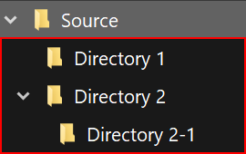
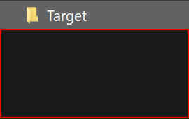
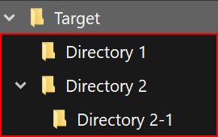
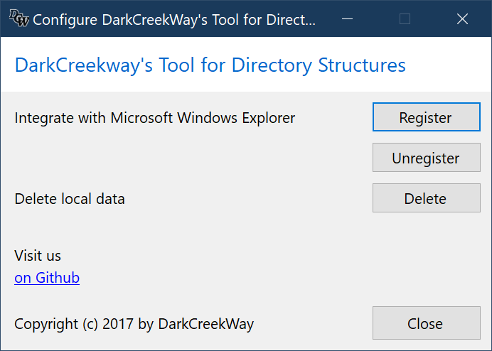


# DarkCreekway's Tool for directory structures

---

## Introduction

Structuring files using directories has many advantages.

* It makes it easier to find important information and helps to manage the
  increasing flood of data more efficiently.

* Facilitates smoother work by reducing the load on the system,
  since with an increasing number of files in a directory,
  many computer systems need longer for the listing.

A proven directory structure to further or new directories to transfer
is not possible without further ado.

The use of e.g. the **copy & paste** function of the Microsoft Windows
Explorer is not possible, because not only the structure, but also all files are copied.

So the only way left is to create the desired structure by hand.

**DarkCreekWay's tool for directory structures** closes this gap and is
easily accessible via the Microsoft Windows Explorer context menu.

**Screenshot of the context menu (Windows 10 Dark Mode)**

---

## Functionality

Directory structures (or structures for short) below a directory
can be captured using the Windows Explorer context menu and then applied to other
directories as often as desired.

### Example

The structure of the directory *Source* is to be applied to the directory *Target*.
directory.

|Source|Target|
|-|-|-|
|  |  |
| directory *Source* with structure | directory *Target* without structure (empty) |

To do this, the structure of the directory *Source* must first be captured by
the tool and then applied it to the *Target* directory.

### Procedure

1. Capture the structure of the *Source* directory
   1. Open the context menu of the *Source* directory
   2. Select menu item **Directory structure** > **Capture**.
2. Apply the captured structure to the *Target* directory
   1. Open the context menu of the *Target* directory
   2. Select menu item **Directory structure** > **Apply**.

### Result

|Source|Target|
|-|-|-|
|  |  |
structure below directory *Source* | structure below directory *Target*

---

## Functions

### Capture directory structure

In order to apply a structure to a target directory, it must first be captured by the tool.

Afterwards, this captured structure can be applied to target directories as many
times as you like.

> The tool always captures only one structure.
> The last structure captured is always applied.

#### Capturing a directory structure with Windows Explorer

* Navigate to the directory that contains the desired structure.

##### Operation with the mouse

* Open the context menu by clicking with the **right mouse button** on the directory.
* **Windows 11 only** - Click on the **Show more options** menu item.
* Select the **Directory Structure -> Capture** menu by moving the pointer
  over the **Directory Structure** entry to the **Capture** entry.
* Select the **Capture** entry by clicking the **left mouse button**.

##### Operation with the keyboard

* Select the directory
* Press the key combination **\<Shift\> + \<F10\>**.
* Select the **Directory Structure -> Capture** menu by moving your selection
  with the **\<arrow keys\>** over the entry **Directory Structure** to the
  **Capture** entry.
* Select the **Capture** entry by pressing **\<Enter\>**.

##### Result

The structure **below** the selected directory is capured by the tool.

> **Note**
> Before using it via Microsoft Windows Explorer, the tool must have been integrated into Windows Explorer.
> For detailed instructions, please refer to the [Configuration](#configuration) chapter.

### Apply directory structure

A structure captured by tool can be applied to target directories as often as
as often as required.

> The tool always saves only one structure.
> The last structure saved is always applied.
>
> If no structure has been captured before invoking the command an error message gets shown.

#### Apply directory structure with Windows Explorer

* Navigate to the directory to which the captured structure is to be applied.

##### Operation with the mouse

* Open the context menu by clicking with the **right mouse button** on the directory.
* **Windows 11 only** - Click on the **Show more options** menu item.
* Select the **Directory Structure -> Apply** menu by moving the pointer
  over the **Directory Structure** entry to the **Apply** entry.
* Select the **Apply** entry by clicking the **left mouse button**.

##### Operation with the keyboard

* Select the directory
* Press the key combination **\<Shift\> + \<F10\>**.
* Select the **Directory Structure -> Apply** menu by moving your selection
  with the **\<arrow keys\>** over the entry **Directory Structure** to the
  **Apply** entry.
* Select the **Apply** entry by pressing **\<Enter\>**.

##### Result

The captured structure will be applied **below** the selected directory.

> **Note**
> Before using it via Microsoft Windows Explorer, the tool must have been integrated into Windows Explorer.
> Detailed instructions can be found in the [Configuration](#configuration) chapter.

---

## Configuration

The tool can be quickly and easily integrated into your system and configured
via the supplied configuration interface.

### Open configuration Interface

* Navigate to the installation folder using Windows Explorer.
* Start the configuration interface by double-clicking on the file **ds.config.exe**

> Location **%localappdata%\Programs\DarkCreekWay\\DirectoryStructures\\**

### Configuration Interface functions

#### Microsoft Windows Explorer Integration

Through the integration you can use the tool conveniently via the context menu of the Microsoft Windows Explorer.

> **Note**
> Integration is done separately for each user of the computer.

##### *Register* button

Use the **Register** button to add the context menu entries
to Microsoft Windows Explorer.

##### *Unregister* button

Use the **Unregister** button to remove the context menu entries
from Microsoft Windows Explorer.

#### Delete local data

For the correct functioning and during the use of the tool, data will be stored in the user's profile.

> Location **%localappdata%\\DarkCreekWay\\\DirectoryStructures\\**.

If you want to completely remove the application from your system, you can delete the local data first.

##### *Delete* button

The **Delete** button deletes local data from the user's profile.

#### External links

You can visit us online on GitHub via the *on GitHub* link.

---

## Compatibility and requirements

### Compatibility

DarkCreekWay's tool for directory structures has been developed and tested on **Windows 10 (x64)** and **Windows 11 (x64)**

> Older Windows versions are neither tested nor supported by us.

### Microsoft .NET Runtime

DarkCreekWay's tools are based on Microsoft .NET technologies.
The .NET 6.0 Desktop Runtime is required to run this application.

#### Check installed .NET version

If you already have a .NET Core installation on your PC, you can
check the availability of .NET 6 on your system from the command line.

If your system does not have a matching installation, you will either get an
error message or blank or no output.

In these cases, you must install the .NET 6 Desktop Runtime on your system first.

##### DOS

~~~console
dotnet --info | find "Microsoft.WindowsDesktop.App 6"
~~~

##### PowerShell

~~~PowerShell
(dotnet --info) | select-string -pattern "Microsoft.WindowsDesktop.App 6"
~~~

#### Download and install .NET 6

##### Selecting the correct installation package

To select the correct installation package, you need to determine your processor architecture.
do thisby running one of the following commands from the command line
and then determine the correct package.

###### DOS

~~~console
echo %PROCESSOR_ARCHITECTURE%
~~~

###### PowerShell

~~~PowerShell
 $Env:PROCESSOR_ARCHITECTURE
~~~

Determine the correct package for the displayed value using the following table

| Output | Package |
|:------:|:-------:|
|  x86   |   x86   |
| AMD64  |   x64   |
| ARM64  |  Arm64  |

Download the .NET 6 **Desktop Runtime** package suitable for your system.

Start the installation by double-clicking on the downloaded file
and follow the installation instructions.

> Please download the installation for your PC below the **Run desktop apps** section.
>
> Only this download contains all necessary components.

[Download .NET 6.0 Runtime](https://dotnet.microsoft.com/en-us/download/dotnet/6.0/runtime)

---

## Download

Please download the latest version here

| Operating System | Architecture | .NET Runtime                            | Download                                                                                                                      |
| ---------------- | ------------ | --------------------------------------- | -------------------------------------------------------------------------------------------------------------------- |
| Windows 10       | x86, x64     | .NET 6.0 Desktop Runtime (Prerequisite) | [Download](https://github.com/DarkCreekWay/DirectoryStructures/releases/latest/download/DCW-DirectoryStructures-net6.0-windows.7z) |
| Windows 11       | x86, x64     | .NET 6.0 Desktop Runtime (Prerequisite) | [Download](https://github.com/DarkCreekWay/DirectoryStructures/releases/latest/download/DCW-DirectoryStructures-net6.0-windows.7z) |

## Installation

> Please check your system for [Compatibility and requirements](#compatibility-and-requirements) before installation.

* Unzip the downloaded 7z file
* Execute the **install.ps1** file
  
> Right-click on the **install.ps1** file
> and select the menu item **Run with PowerShell**.

After installation, you must configure the tool before using it for the first time.
To do this, follow the instructions in the [Configuration](#configuration) section.

---

## Current Limitations & Known issues

* Long Pathname Support

The application was not tested with Long Pathnames Support (Path length > 260)
If the maximum path length exceeds 260 chars, the result is not known.

* NTFS Access Control Lists

The application does not implement any ACL related functionality.
Depending on the concrete ACLs, the application might fail to capture or apply
directory structures.

---

## For IT Pros'

### Cheatsheet

Installation: **Per user**

#### Requirements

| Component        |                        |
|------------------|------------------------|
| Operating System | Windows 10 (x86\|x64)  |
|                  | Windows 11 (x86\|x64)  |
| .NET Runtime     | .NET 6 Desktop Runtime |

#### Changes to the system

The following changes are made on the hard disk and in the Windows registry:

| Type        | Change | Path                                                               |
|-------------|--------|--------------------------------------------------------------------|
| Application | Added  | %localappdata%\Programs\DarkCreekWay\DirectoryStructures           |
| Data        | Added  | %localappdata%\DarkCreekWay\DirectoryStructures                    |
| Registry*   | Added  | HKEY_CLASSES_ROOT\Directory\shell\DarkCreekWay.DirectoryStructures |

> \* Changes to the registry are made through the configuration interface **ds.config.exe**.

### Using the application from the command line

Open a command line (e.g. DOS console, PowerShell console, Windows terminal, or similar)
and change to the application directory

> It is recommended to add the path to the application to the **PATH** environment variable.

#### Save directory structure via command line

Invoke the command **ds.exe** with the **capture** subcommand and the full
path to the source directory.

##### Syntax

ds.exe capture \<path to source directory\>

> If the path to the source directory contains spaces, the path must be enclosed with "\".

##### Example

~~~console

ds.exe capture "c:\users\source directory"
~~~

#### Apply directory structure via command line

Invoke the **ds.exe** command with the **apply** subcommand and the full
path to the target directory.

##### Syntax

ds.exe apply \<path to target directory\>

> If the path to the target directory contains spaces, the path must be enclosed with \".

##### Example

~~~console

ds.exe apply "c:\users\exampleuser\target directory"
~~~

### Exit Codes

| Exit Code | Scope           | Description                            |
|----------:|-----------------|----------------------------------------|
|         0 | Global          | Success                                |
|         1 | App             | Parameter Count is insufficient        |
|         2 | App             | Command is unknown                     |
|       100 | Common          | Directory does not exist               |
|       200 | Capture Command | Directory Parameter Missing            |
|       300 | Apply Command   | Directory Parameter Missing            |
|       301 | Apply Command   | Captured Directory Structure Not Found |

---

## About DarkCreekWay's Toolbox

Modern operating systems provide users with a wide range of functions.

Basic on-board tools are included with the operating systems for important
maintenance and repair work.

However, rarely are there tools for coping with everyday work among them.

The tools from **DarkCreekWay's Toolbox**

* close function and comfort gaps
* make computer work more intuitive, faster and more efficient
* reduce WTF-moments and decrease stress at the PC

Have fun :-)

---

Copyright (c) 2017 by [DarkCreekWay](https://github.com/DarkCreekWay)
